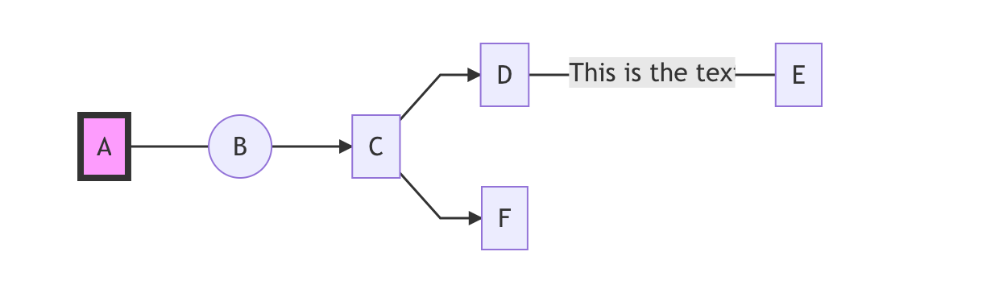
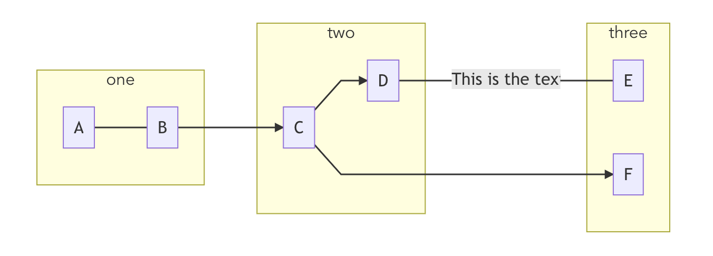

# vue-mermaid

> flowchart of mermaid with vue componet

## Requirements

- [Vue.js](https://github.com/vuejs/vue)
- [mermaid](https://github.com/knsv/mermaid)

## Install Setup

```bash
# install dependencies
npm install --save vue-mermaid

```

## Usage

### Register component

```js
import VueMermaid from "vue-mermaid";
Vue.use(VueMermaid);
```

### Use component

```js
export default {
  data: function() {
    return {
      data: [
        {
          id: "1",
          text: "A",
          link: "---",
          next: ["2"],
          editable: true,
          style: "fill:#f9f,stroke:#333,stroke-width:4px"
        },
        { id: "2", text: "B", edgeType: "circle", next: ["3"] },
        { id: "3", text: "C", next: ["4", "6"] },
        { id: "4", text: "D", link: "-- This is the text ---", next: ["5"] },
        { id: "5", text: "E" },
        { id: "6", text: "F" }
      ]
    };
  },
  methods: {
    editNode(nodeId) {
      alert(nodeId);
    }
  }
};
```
#### Different link values of next:

```vue
nodes: [
        {
          id: "1",
          text: "A",
          link: ["-- yes -->", "-- no -->"],
          next: ["2", "3"],
          editable: true
        },
        { id: "2", text: "B" },
        { id: "3", text: "C"}
      ],
```


#### Possible edgeType values:


### Template

```vue
<template>
  <vue-mermaid
    :nodes="data"
    type="graph LR"
    @nodeClick="editNode"
  ></vue-mermaid>
</template>
```

### Result



### Group Type

```js
export default {
  data: function() {
    return {
      data: [
        {
          id: "1",
          text: "A",
          link: "---",
          next: ["2"],
          group: "one"
        },
        { id: "2", text: "B", edgeType: "circle", next: ["3"], group: "one" },
        { id: "3", text: "C", next: ["4", "6"], group: "two" },
        {
          id: "4",
          text: "D",
          link: "-- This is the text ---",
          next: ["5"],
          group: "two"
        },
        { id: "5", text: "E", group: "three" },
        { id: "6", text: "F", group: "three" }
      ]
    };
  }
};
```



### Theme

- To change theme, you can pass in a config object, for available themes, you can refer to [mermaidjs themes](https://github.com/mermaid-js/mermaid/tree/master/src/themes)

```vue
<template>
  <vue-mermaid
    type="graph LR"
    :config="config"
  ></vue-mermaid>
</template>
```

```js
export default {
  data: function() {
    return {
      config: {
        theme: 'neutral'
      }
    };
  }
};
```


## Build Setup

```bash
# install dependencies
npm install

# build for production with minification
npm run build
```
