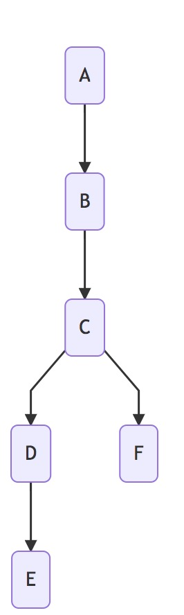

# vue-mermaid

> flowchart of mermaid with vue componet

## Requirements

- [Vue.js](https://github.com/vuejs/vue)
- [mermaid](https://github.com/knsv/mermaid)

## Install Setup

``` bash
# install dependencies
npm install --save vue-mermaid

```

## Usage

### register component

```js
import VueMermaid from 'vue-mermaid'
Vue.use(VueMermaid)
```

### use component

```js
export default {
  data:function(){
    return {
      data:[
        {id:'1',text:'A',next:['2']},
        {id:'2',text:'B',next:['3']},
        {id:'3',text:'C',next:['4','6']},
        {id:'4',text:'D',next:['5']},
        {id:'5',text:'E'},
        {id:'6',text:'F'}
      ]
    }
  }
}
```

### template

```vue
<template>
  <vue-mermaid :nodes="data"></vue-mermaid>
</template>
```

### result



## Build Setup

``` bash
# install dependencies
npm install

# build for production with minification
npm run build
```
